# Passive Channel Charting: Locating Passive Targets using Wi-Fi Channel State Information

<a href="https://espargos.net"></a>

This repository contains partial source code for the results presented in the paper

> <a href="https://arxiv.org/abs/2504.09924">Florian Euchner, David Kellner, Phillip Stephan, Stephan ten Brink: "Passive Channel Charting: Locating Passive Targets using Wi-Fi Channel State Information"</a>

submitted to the IEEE Workshop on Signal Processing and Artificial Intelligence in Wireless Communications (SPAWC 2025) and <a href="https://arxiv.org/abs/2504.09924">available as a preprint on arXiv</a>.

## Summary

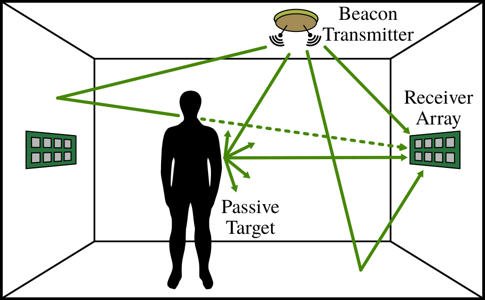

Based on a Wi-Fi Channel State Information (CSI) dataset collected with [ESPARGOS](https://espargos.net/), we demonstrate that [channel charting](https://channelcharting.github.io/) methods can be used for passive target localization.
Algorithms and neural network architectures developed for channel charting with active mobile transmitters can be applied to a scenario with static transmitters and receivers and a mobile target.
By leveraging the dimensionality reduction approach of channel charting and using a Siamese neural network trained in a self-supervised manner, we can <b>more accurately localize the passive target without requiring labelled training data</b>.

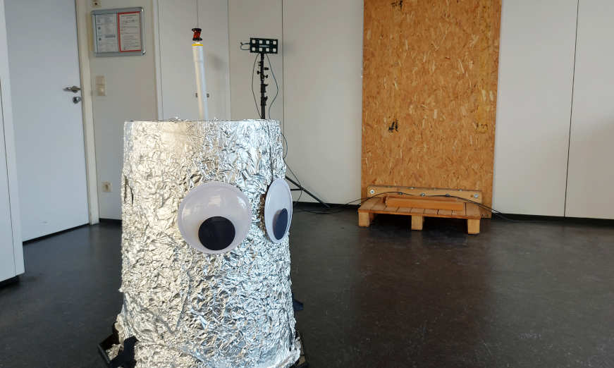

For our evaluations, we use the [`espargos-0007`] CSI dataset, which was collected indoors with a distributed setup of four ESPARGOS Wi-Fi sensing antenna arrays.
The passive target is a robot wrapped in aluminium foil, or a human, which moves around in the measurement area while four static Wi-Fi transmitters constantly spam beacon frames.

As in conventional channel charting, we train a neural network to reconstruct a physically interpretable map of target positions from similarities in high-dimensional channel state information (CSI).

Our results indicate that passive channel charting (PCC) can outperform classical localization methods like triangulation in terms of localization accuracy.
This comes at the cost of overfitting to a particular target type, which is an issue that channel charting with an active transmitter does not have.

<!--
In order to obtain a channel chart in global coordinates (to compute meaningful localization performance metrics), we evaluated two approaches that provide similar accuracy:
1. Find an optimal coordinate transform for the predictions of the already trained forward charting function (FCF), using the position labels.
2. Train an augmented FCF which directly predicts positions in global coordinates by also incorporating classical triangulation into the loss function.
-->

## Results

The neural networks for fingerprinting and channel charting are trained on a training set with the robot as passive target.

Reference Positions (Tachymeter) | Channel Chart Training
:-:|:-:
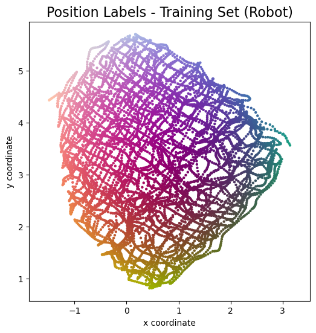 | 

Performance of the neural network-based approaches and classical triangulation were evaluated using a test set of previously unseen CSI.

### Robot Test Set

Reference Positions (Tachymeter) | Classical: Estimated Positions
:-:|:-:
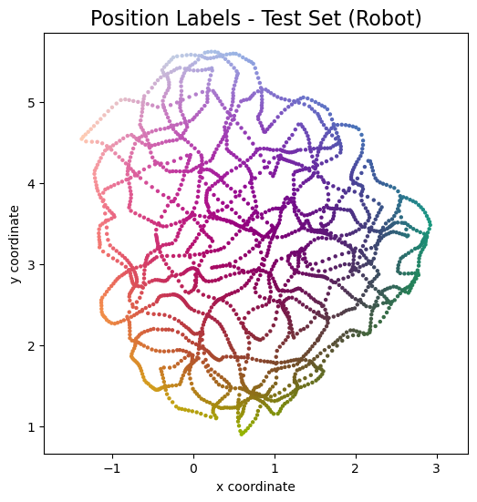 | 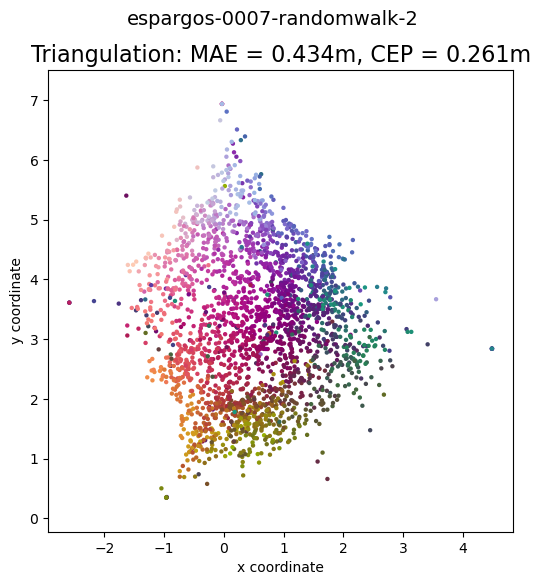

Channel Chart | Fingerprinting: Estimated Positions
:-:|:-:
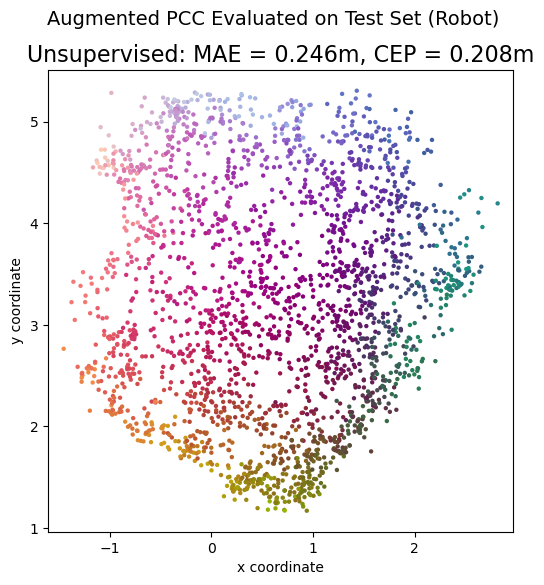 | 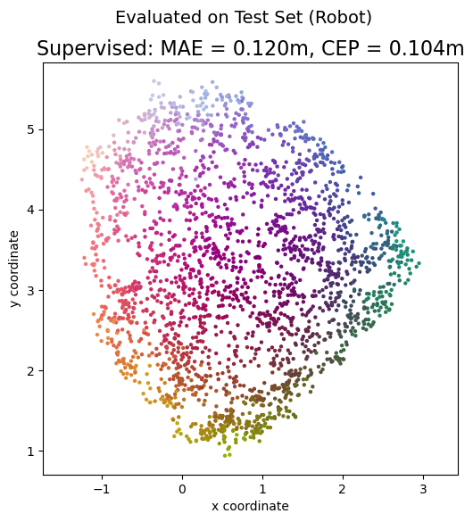

### Human Test Set (Transfer)

Reference Positions (Tachymeter) | Classical: Estimated Positions
:-:|:-:
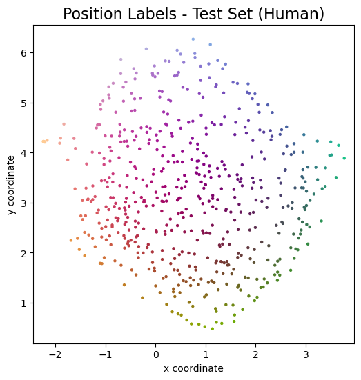 | 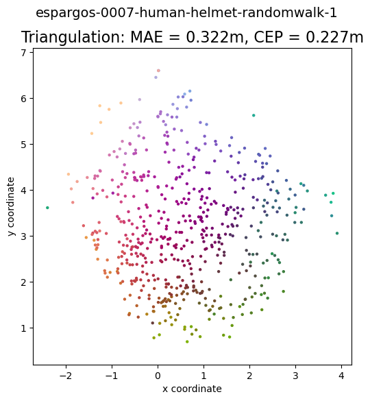

Channel Chart | Fingerprinting: Estimated Positions
:-:|:-:
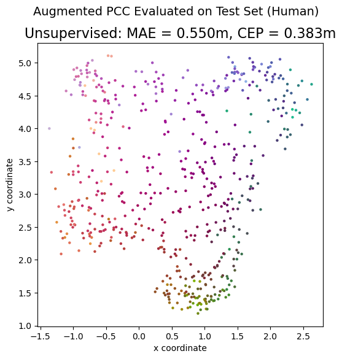 | 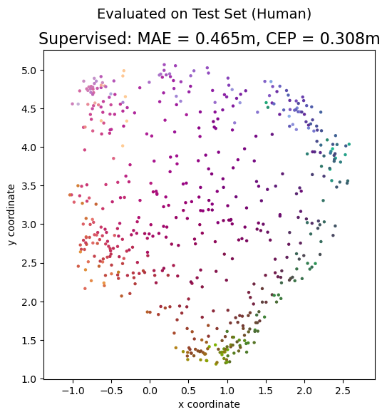

### Performance Comparison

| Method | Target | MAE | DRMS | CEP | R95 | KS | CT / TW |
| -: | :-: | :-: | :-: | :-: | :-: | :-: | :- |
| Classical AoA  | Robot | 0.434 m | 0.694 m | 0.261 m | 1.368 m | 0.273 | 0.927/0.922 |
| Fingerprinting | Robot | 0.120 m | 0.145 m | 0.104 m | 0.268 m | 0.067 | 0.996/0.996 |
| Augmented PCC  | Robot | 0.246 m | 0.295 m | 0.208 m | 0.581 m | 0.129 | 0.988/0.990 |
| Classical AoA  | Human | 0.322 m | 0.499 m | 0.227 m | 0.775 m | 0.123 | 0.989/0.988 |
| Fingerprinting | Human | 0.465 m | 0.630 m | 0.308 m | 1.352 m | 0.206 | 0.966/0.978 |
| Augmented PCC  | Human | 0.550 m | 0.724 m | 0.383 m | 1.565 m | 0.236 | 0.959/0.972 |

MAE = mean absolute error, DRMS = distance root mean squared, CEP = circular error probable, R95 = 95<sup>th</sup> error percentile, KS = Kruskal Stress, CT/TW = Continuity / Trustworthiness

### Empirical Cumulative Distribution Function of Absolute Localization Error

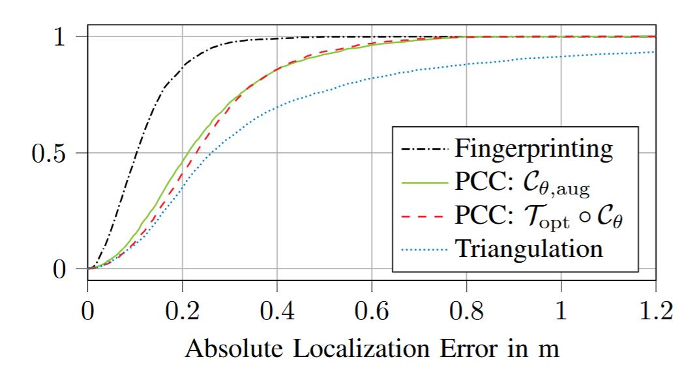

## Prerequisites

Our code is based on Python, TensorFlow, NumPy, SciPy and Matplotlib.
Source files are provided as Jupyter Notebooks, which can be opened directly here on GitHub or using, e.g., [JupyterLab](https://jupyter.org/).

We run our Channel Charting experiments on a JupyterHub server with NVMe storage, AMD EPYC 7262 8-Core Processor, 32GB RAM, and a NVIDIA GeForce RTX 4080 GPU for accelerating TensorFlow.
All indications of computation times are measured on this system.

## How to use

The Jupyter Notebooks in this repository are numbered. You must execute them in the right order.
You may choose to skip step 2 if you are not interested in the supervised training performance, but you must perform all other steps to learn a channel chart in step 6.

* `0_DownloadDataset.ipynb`: Download the necessary parts of the [`espargos-0007`] dataset that we use for training and testing.
* `1_ClutterChannels.ipynb`: Estimate unwanted clutter in the CSI data using the CRAP algorithm and store the resulting clutter channels. These will be used in all subsequent notebooks to remove the clutter as a first CSI processing step.
* `2_SupervisedBaseline.ipynb`: Predict the position of the passive target using CSI fingerprinting with a neural network.
* `3_AoA_Estimation.ipynb`: Estimate the angle of arrival for each CSI cluster and each receiving antenna array using the unitary root MUSIC algorithm and store the results.
* `4_Triangulation.ipynb`: Predict the position of the passive target using classical triangulation of the AoA estimates for all antenna arrays. Also store the triangulation results for the next step.
* `5_DissimilarityMatrix.ipynb`: Compute the fused dissimilarity matrix (angle delay profile + timestamp-based) and its geodesic version. Scale the distances to meters using the triangulation estimates.
* `6_ChannelCharting.ipynb`: Train the neural network that implements the forward charting function (FCF), first with a loss function that uses the previously computed geodesic dissimilarity matrix. Training is based on a Siamese neural network. In order to obtain a channel chart in global coordinates without an additional transform, train an alternative augmented FCF that also incorporates the computed AoA estimates into the loss function.

## Citation

```
@misc{euchner2025passive,
	title  = {{Passive Channel Charting: Locating Passive Targets using Wi-Fi Channel State Information}},
	author = {Euchner, Florian and Kellner, David and Stephan, Phillip and ten Brink, Stephan},
	year   = {2025},
	url    = {https://arxiv.org/abs/2504.09924}
}
```

## Other Resources

* [Christoph Studer's Channel Charting Website](https://channelcharting.github.io/)
* [Original ESPARGOS Introduction Paper](https://ieeexplore.ieee.org/abstract/document/10104556)
* [ESPARGOS Website](https://espargos.net/)
* [Our tutorial on dissimilarity metric-based Channel Charting](https://dichasus.inue.uni-stuttgart.de/tutorials/tutorial/dissimilarity-metric-channelcharting/)
* [Our paper on dissimilarity metric-based Channel Charting](https://arxiv.org/abs/2308.09539)
* [Our paper on augmented Channel Charting](https://arxiv.org/abs/2312.01968)

[`espargos-0007`]: https://espargos.net/datasets/data/espargos-0007/
